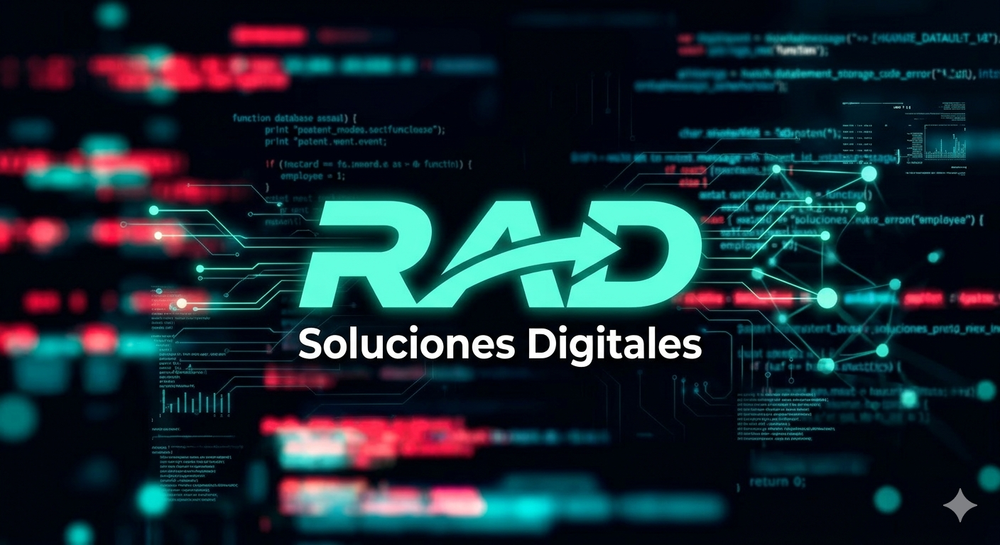

# <p align="center">✨ Portafolio Profesional: Rubén Azócar Daroch ✨</p>

<p align="center">
  
  
  
</p>

---

##  Introducción

Bienvenido a mi espacio digital. Soy un **Desarrollador Full Stack** apasionado por construir experiencias excepcionales que combinan código limpio, diseño intuitivo y soluciones escalables. Este proyecto no es solo un portafolio; es una demostración en vivo de mis capacidades técnicas.

> "Construyo el futuro digital con soluciones seguras y código de alto nivel."

---

## 🎨 Características Premium

- **Modo Oscuro/Claro**: Interfaz adaptable con persistencia en `localStorage`.
- **Integración con GitHub API**: Los proyectos se cargan en tiempo real desde mis repositorios públicos.
- **Diseño Glassmorphic**: Efectos de desenfoque y profundidad modernos.
- **Scroll Reveal**: Animaciones suaves al navegar por las secciones.
- **Typing Effect**: Animación de escritura dinámica en la cabecera.
- **Totalmente Responsive**: Optimizado para cualquier dispositivo.

---

## 🛠️ Stack Tecnológico

<p align="center">
  <!-- Frontend -->
  
  
  
  
  
  <!-- Backend -->
  
  
  
  
  <!-- Databases & Tools -->
  
  
  
</p>

---

## 📁 Estructura del Proyecto

El código está organizado de manera modular y limpia para facilitar su escalabilidad:

```bash
Portafolio/
├── 📂 img/            # Recursos gráficos y logos
├── 📂 CV/             # Documentos profesionales (PDF)
├── 📂 certificates/   # Certificaciones respaldadas (Google, Oracle, Alura)
├── 📄 index.html      # Núcleo de la estructura y SEO
├── 📄 styles.css      # Sistema de diseño, variables y animaciones
└── 📄 script.js       # Lógica principal e interacción dinámica
```

---

## 🚀 Configuración y Uso Local

1. **Clonar el repositorio**:
   ```bash
   git clone https://github.com/RubenAzocar/Portafolio.git
   ```
2. **Personalización del Usuario**:
   Edita el objeto `CONFIG` al inicio de `script.js` con tus datos:
   ```javascript
   const CONFIG = {
     githubUsername: 'RubenAzocar',
     linkedinUrl: 'https://linkedin.com/in/razocardaroch',
     email: 'Progpythontest@gmail.com',
     // ... frases que desees mostrar
   };
   ```
3. **Lanzar el sitio**:
   Se recomienda usar [Live Server](https://marketplace.visualstudio.com/items?itemName=ritwickdey.LiveServer) de VS Code o un servidor HTTP simple para evitar bloqueos de CORS al consumir la API de GitHub.

---

## 📬 Contactémos

¿Tienes un proyecto en mente o solo quieres decir hola? 👋

<p align="center">
  <a href="mailto:Progpythontest@gmail.com">
    
  </a>
  <a href="https://linkedin.com/in/razocardaroch">
    
  </a>
  <a href="https://github.com/RubenAzocar">
    
  </a>
</p>

---

<p align="center">
  Desarrollado con ❤️ y mucho ☕ en <b>Chile</b>. <br>
  &copy; 2025 Rubén Azócar Daroch — Todos los derechos reservados.
</p>
# Portafolio-Profesional-RAD
# Portafolio-Profesional-RAD
